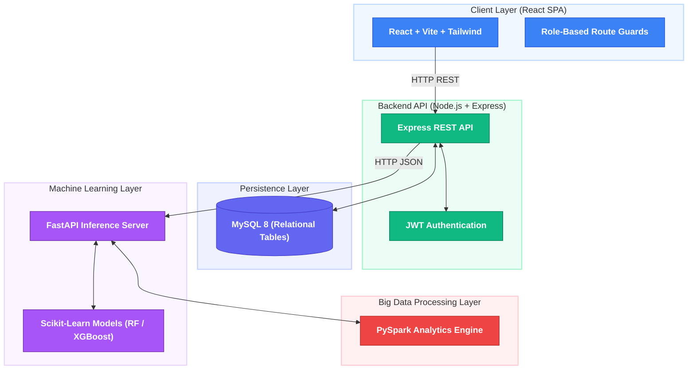
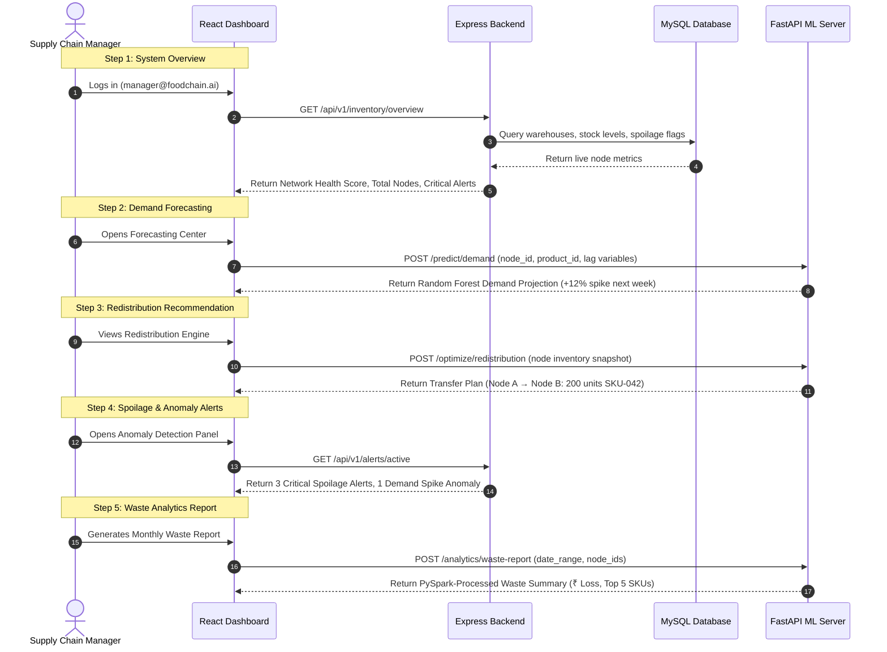

# AI-Powered Distributed Food Supply Chain Optimization & Inventory Redistribution System

**FoodChain AI** is an intelligent supply chain management platform designed to minimize food wastage, optimize inventory distribution, and improve demand forecasting accuracy across multiple warehouses and retail nodes. Moving beyond static inventory trackers, the system analyzes historical sales data, predicts future demand, detects spoilage risks, and delivers prescriptive redistribution recommendations to supply chain managers in real time.

> Built using **React.js**, **Node.js**, **Express.js**, **MySQL**, **Python FastAPI**, **Scikit-Learn / PySpark ML Models**, and **React SPA (JavaScript + Vite + Tailwind CSS)**.

     

---

## 🏛 System Architecture

The system follows a **Distributed Node-Based 3-Tier Architecture** where every warehouse, retail store, or distribution centre operates as an independent supply chain node — continuously monitored, locally optimized, and globally interconnected through a centralized intelligence layer.



### Stack Components

- **React SPA**: Interactive admin dashboard with real-time inventory charts, node-level monitoring, redistribution recommendation panels, and anomaly alert feeds.
- **Node.js + Express Backend**: Core API server handling JWT authentication, supply chain CRUD operations, inter-node coordination, and ML inference proxying.
- **MySQL 8**: Relational persistence for all supply chain entities — warehouses, products, inventory records, sales history, redistribution logs, and spoilage reports.
- **Python FastAPI ML Server**: Serves trained Scikit-Learn models for demand forecasting, spoilage risk prediction, redistribution optimization, and anomaly detection.
- **PySpark**: Distributed big data processing engine handling large-scale inventory and logistics datasets generated across all supply chain nodes.

---

## 🌟 Core Platform Modules

| Module | Feature | Capability Description |
| --- | --- | --- |
| **Module 1** | **Inventory Monitoring** | Real-time stock levels, product expiry dates, inventory turnover rates, and warehouse capacity utilization across all distributed nodes. |
| **Module 2** | **Demand Forecasting** | ML-based forecasting using historical sales data, seasonal trends, and consumer behaviour patterns to predict future product demand per node. |
| **Module 3** | **Inventory Redistribution Engine** | Automated identification of overstocked and understocked locations with AI-generated inter-store transfer recommendations to balance supply. |
| **Module 4** | **Spoilage Prediction** | Product shelf-life modeling and expiry risk scoring that flags high-loss inventory categories before spoilage occurs. |
| **Module 5** | **Anomaly Detection** | Real-time detection of unusual demand spikes, supply inconsistencies, and inventory fluctuations to enable proactive operational decisions. |
| **Module 6** | **Waste Analytics** | Aggregated food wastage reports, high-loss SKU identification, trend analysis, and actionable waste reduction insights across the supply chain. |
| **Module 7** | **Big Data Processing** | PySpark-powered distributed analytics pipeline processing large-scale inventory and logistics datasets across all warehouse and retail nodes. |
| **Module 8** | **Admin Analytics Dashboard** | Centralized visualization of inventory movement, forecasting outputs, redistribution plans, waste metrics, and node-level health through live charts. |
| **Module 9** | **Role-Based Access Control (RBAC)** | Strict privilege isolation across `SUPPLY_CHAIN_MANAGER`, `WAREHOUSE_ADMIN`, and `VIEWER` roles. |

---

## 🛡️ Role-Based Access Control (RBAC)

### 1. Viewer (`VIEWER`)
- **Permissions**: Read-only access to inventory dashboards, product lists, and waste analytics reports for their assigned node.
- **Restrictions**: Cannot modify stock data, trigger redistribution actions, or access ML forecasting modules.

### 2. Warehouse Administrator (`WAREHOUSE_ADMIN`)
- **Permissions**: Full control over their assigned node — update stock levels, log incoming/outgoing shipments, mark spoilage events, view node-specific forecasts and anomaly alerts.
- **Restrictions**: Cannot execute cross-node redistribution decisions or access system-wide analytics.

### 3. Supply Chain Manager (`SUPPLY_CHAIN_MANAGER`)
- **Permissions**: **Highest Privilege (Unrestricted)**. Full system access — cross-node inventory overview, ML demand forecasts, AI redistribution recommendations, anomaly detection feeds, waste analytics, and PySpark report generation.

---

## 🎬 Platform Demonstration Flow



---

## 🗄️ Database Schema (MySQL)

The system uses **MySQL 8** with the following core relational tables:

| Table | Description |
| --- | --- |
| `users` | User accounts with roles (`SUPPLY_CHAIN_MANAGER`, `WAREHOUSE_ADMIN`, `VIEWER`) |
| `nodes` | Warehouses, retail stores, and distribution centres in the supply chain network |
| `products` | Product catalogue with SKU, category, shelf life, and unit cost |
| `inventory` | Real-time stock levels per product per node, with expiry and reorder thresholds |
| `sales_records` | Historical sales transactions used as ML training input |
| `redistribution_logs` | Inter-node stock transfer records with status tracking |
| `spoilage_events` | Logged spoilage incidents with product, quantity, and estimated loss |
| `anomaly_alerts` | Detected demand or supply anomalies with severity classifications |

---

## 🚀 Getting Started

### Prerequisites
- **Node.js**: v18+ (with npm)
- **Python**: v3.9+
- **Database**: MySQL 8 (running locally on port 3306 or in Docker)
- **Java (optional)**: Required only if running PySpark locally in standalone mode

---

### Running the System Services

#### 1. Machine Learning Layer (FastAPI + PySpark Server)

```bash
# Navigate to the ml/ directory
cd ml

# Create and activate a virtual environment
python -m venv venv
source venv/bin/activate       # Windows: venv\Scripts\activate

# Install dependencies
pip install fastapi uvicorn scikit-learn xgboost pandas numpy pydantic pyspark

# Train models on synthetic / historical data
python train_models.py

# Launch ML Inference Service on port 8000
python ml_service.py
```

#### 2. Backend API (Node.js + Express)

```bash
# Navigate to the backend/ directory
cd backend

# Install dependencies
npm install

# Configure environment variables
cp .env.example .env
# Edit .env with your MySQL credentials and JWT secret

# Initialize the database schema
npm run db:migrate

# Start the Express server on port 5000
npm run dev
```

#### 3. Frontend SPA (React + Vite)

```bash
# Navigate to the frontend/ directory
cd frontend

# Install dependencies
npm install

# Start the Vite dev server on port 5173
npm run dev
```

Access the application at **`http://localhost:5173`**.

---

### 🔑 Demo Login Credentials

| Role | Email | Password |
| --- | --- | --- |
| Supply Chain Manager | `manager@foodchain.ai` | `password123` |
| Warehouse Admin | `warehouse@foodchain.ai` | `password123` |
| Viewer | `viewer@foodchain.ai` | `password123` |

---

## 📁 Project Structure

```
foodchain-ai/
├── frontend/               # React + Vite + Tailwind SPA
│   └── src/
│       ├── pages/          # Dashboard, Forecasting, Redistribution, Alerts, Waste Analytics
│       ├── components/     # Reusable UI components and charts
│       ├── context/        # Auth context and global state
│       └── api/            # Axios API client
│
├── backend/                # Node.js + Express REST API
│   ├── routes/             # API route definitions
│   ├── controllers/        # Request handlers
│   ├── models/             # MySQL ORM models (Sequelize)
│   ├── middleware/         # JWT auth, RBAC guards, error handlers
│   └── config/             # DB config, environment setup
│
├── ml/                     # Python ML Layer
│   ├── ml_service.py       # FastAPI inference server (port 8000)
│   ├── train_models.py     # Model training pipeline
│   ├── generate_data.py    # Synthetic data generation for training
│   ├── spark_analytics.py  # PySpark big data processing jobs
│   └── models/             # Serialized .joblib model artifacts
│
└── db/
    └── schema.sql          # MySQL DDL — table definitions and seed data
```
